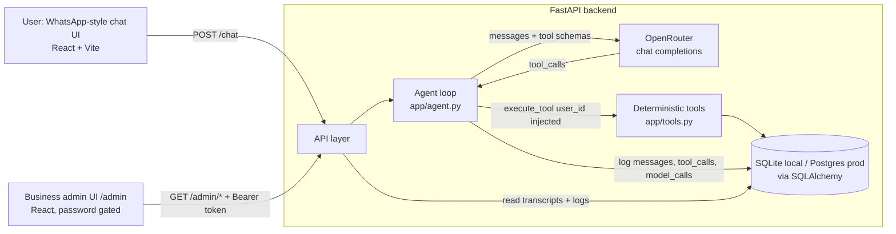

# Architecture

## Request lifecycle (`POST /chat`)
1. Validate user and conversation (conversation must belong to that user).
2. Persist the user message.
3. Load the last 10 stored messages (final text only) + system prompt.
4. Call the model with the 8 tool schemas. If it returns `tool_calls`: run each tool server-side (`user_id` injected), append results, call the model again. Cap: 4 iterations.
5. Persist the assistant message, one `tool_calls` row per tool run, one `model_calls` row per model call (latency, tokens).
6. Flag the conversation `needs_attention` if a tool failed, the iteration cap was hit, or the model stayed unreachable (one retry, then the optional fallback model, then a friendly message).
7. Return `{conversation_id, reply}`.

## Data model
`users` 1—N `properties`; `users` 1—N `conversations` 1—N `messages`; `messages` 1—N `tool_calls`, 1—N `model_calls`. The `tool_calls`/`model_calls` tables are the observability layer the admin UI reads: no separate logging system.

## Three kinds of state (deliberately separate)
1. **Portfolio data** — `properties` table; changed only by `create_property` / `update_property`.
2. **Conversation memory** — `messages` table; last 10 replayed as context.
3. **Hypothetical scenarios** — computed on the fly by `simulate_exclusion`; never persisted.

## Where time goes
Tool execution is milliseconds (SQLite, 12 rows). Nearly all latency is the model round trip(s). See `docs/LATENCY.md` (Step 7).
